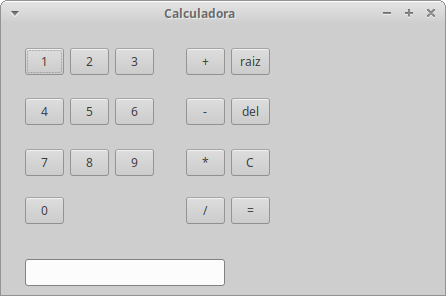

# Calculadora

Una calculadora básica en java con entorno gráfico.

Librería gráfica: SWT

## Uso

Descargar el archivo jar (plataforma independiente) y ejecutarlo.

## Calculadora básica

## License

[Apache version 2.0](https://www.apache.org/licenses/LICENSE-2.0)